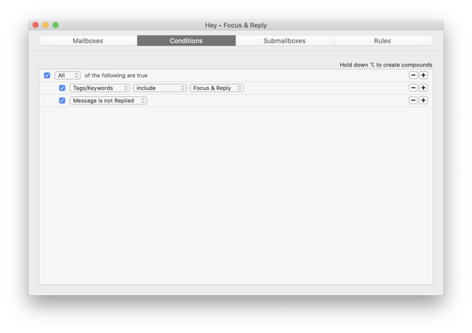
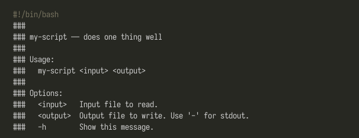

# Funcmarks Weekly Issue 8

### [HEY Email: How It Has Disrupted My Email Workflow - The Sweet Setup][1]

### [Email Is Not Broken - Kev Quirk][2]

### [Replicating Hey.com Features in Regular Email Systems][3]

### [Keen: Pinterest Alternative by Google][4]

### [Linear: The issue tracking tool you'll enjoy using][5]

### [Help message for shell scripts][6]

[1]:	https://thesweetsetup.com/hey-email-disrupted-my-email-workflow/
[2]:	https://kevq.uk/email-is-not-broken/
[3]:	https://blog.andrewcanion.com/2020/06/16/replicating-heycom-features.html
[4]:	https://staykeen.com/
[5]:	https://linear.app
[6]:	https://samizdat.dev/help-message-for-shell-scripts/

